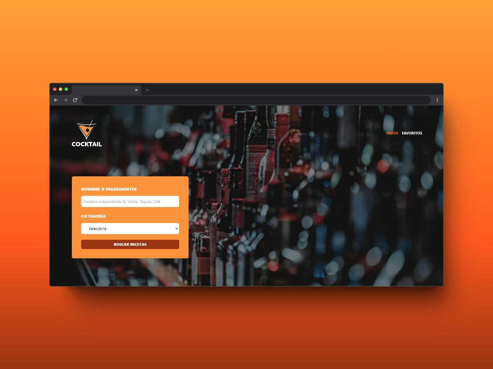
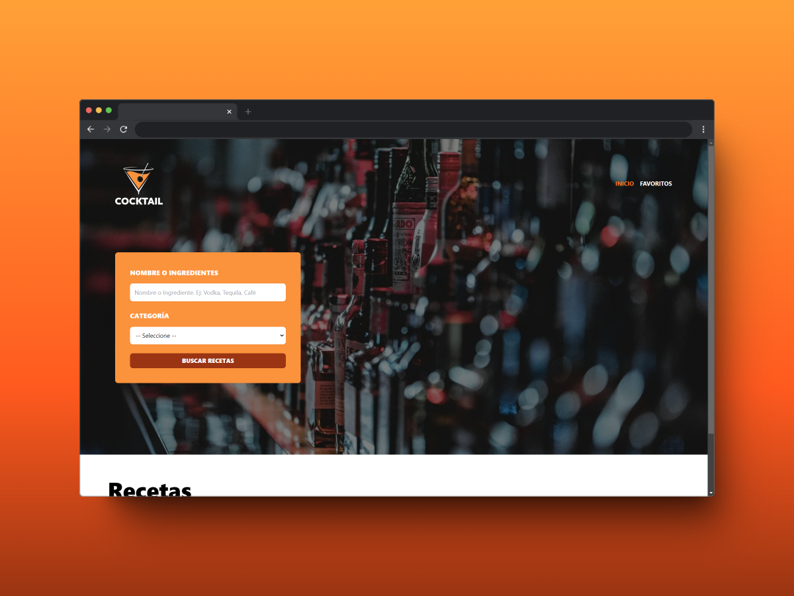
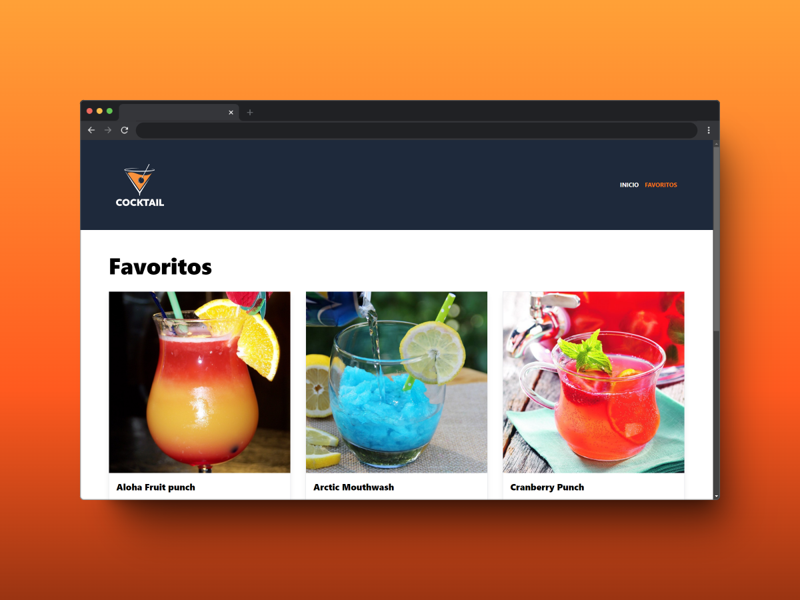
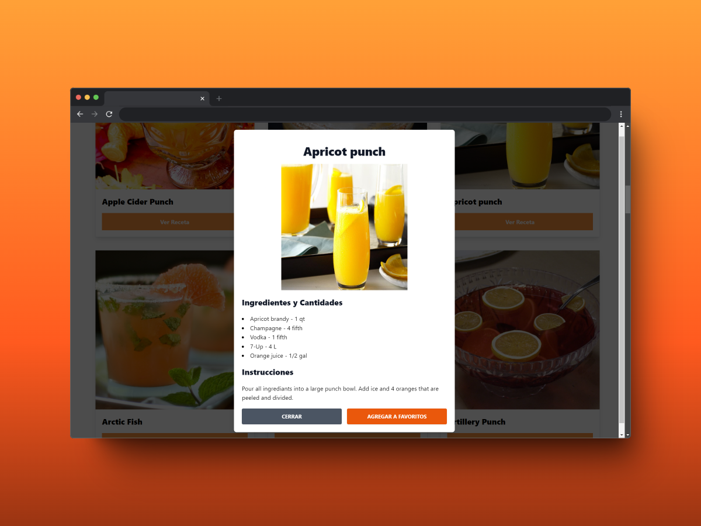

# 🍹 Beverage and Recipe Finder

## 📖 About the Project
**Beverage and Recipe Finder** is a web application that allows you to explore a variety of beverages, complete with detailed recipes. Additionally, it includes a Favorites page where you can save your preferred recipes for easy access later.

## 🎨 Project Features
- **Search and Discover:** Easily search for a wide range of beverages and view detailed recipes for each one.
- **Favorites:** Save your favorite recipes to a dedicated Favorites page for quick and easy access.
- **Responsive Design:** The application is fully responsive, providing a seamless experience on both desktop and mobile devices.
- **Multiple Pages:** Navigate through different sections of the app, including a homepage and favorites page, using React Router.

## 🛠️ Technologies Used
 

## 🌐 API Used
This project utilizes the [TheCocktailDB](https://www.thecocktaildb.com/) API to fetch beverage recipes.

## 📦 Libraries Used
- **Zustand:** Used for state management within the app, following the Slice Pattern for managing multiple stores.

## 📚 What I Learned
This was my first project involving multiple pages, which we implemented using **React Router DOM**, the go-to library for building multi-page React applications. I also explored using the Slice Pattern with **Zustand** for effective state management.

## 🖼️ Screenshots

### Main page

### Favorirtes page

### Drink Details

## 📬 Contact Information

 
 
 
 